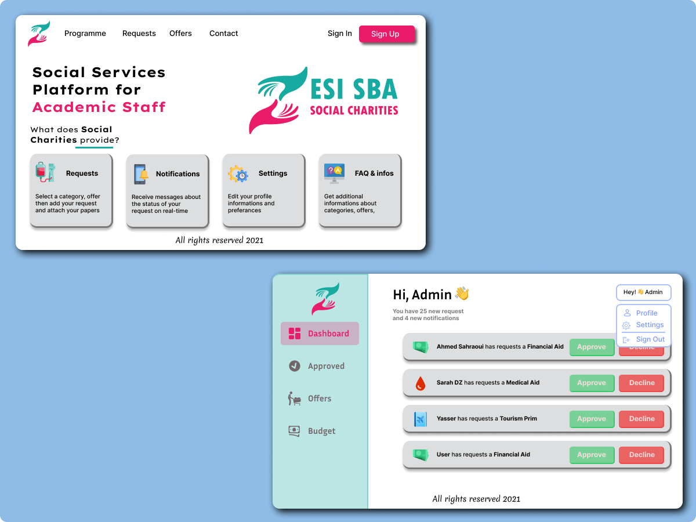

# Social Charities

**Social Charities** is a MERN app that provides some helpfull services for University staff
### Screenshots

 
### How to use

1. Clone/Download the repo.
2. Install dependencies:
   <code>yarn install</code> or <code>npm install</code>
3. Edit your /config/default.json file to include the correct MongoDB URI
4. Run <code>yarn start</code> or <code>npm start</code>.
5. You are ready!
